# 🏥 HealthClaim Analytics Hub

AI-powered patient claims fraud, waste, and abuse (FWA) detection system with interactive network visualization and GPT-4 integration.

> **🕵️‍♀️ Built Upon:** This project is a modern extension and enhancement of the innovative work from the **[Neural Nexus Healthcare Fraud Detection](https://github.com/HackmaniaGX/neural-nexus-healthcare-fwa-analysis)** project. Originally developed for the **ITAG Atlantec Hackathon 2025** held in Galway, that project pioneered the use of graph analysis and machine learning for healthcare fraud detection. This solution modernizes and extends those concepts with a production-ready Streamlit application, advanced AI integration, and enterprise deployment support.
>
> **Original Contributors:** Primarily developed and maintained by **Nithin Mohan T K**  
> **Disclaimer:** This solution uses **synthetic data generated with Irish healthcare context** for demonstration purposes and does not represent actual claims data. It is intended for learning and personal development only.

## 📋 Overview

HealthClaim Analytics Hub is a Streamlit web application designed to help healthcare fraud investigators and analysts:

- **Visualize** patient-provider interaction networks to identify suspicious clusters and referral patterns
- **Detect** anomalous claims using multiple statistical and ML-based methods
- **Analyze** suspicious patterns with AI-powered explanations using OpenAI's GPT models
- **Investigate** fraud rings through interactive filtering and drill-down capabilities
- **Comply** with HIPAA and healthcare data security standards

## 🎯 Key Features

### 🕸️ Network Analysis
- Interactive patient-provider network visualization using Plotly
- Automatic detection of suspicious cliques and highly connected clusters
- Network metrics: density, connectivity, connected components
- Spring-layout visualization optimized for pattern discovery

### 🚨 Anomaly Detection (3 Methods)
1. **Threshold-based**: Simple claim amount filtering
2. **Statistical (Z-Score)**: Deviation-based anomaly flagging
3. **Isolation Forest**: ML-based outlier detection for complex patterns

### 🤖 AI-Powered Insights
- **Anomaly Explanation**: GPT-4 analysis of suspicious claims
- **Network Insights**: AI interpretation of network patterns and fraud rings
- **Q&A Interface**: Ask questions about claims data patterns
- **Actionable Recommendations**: Investigation priorities and next steps

### 📊 Data Management
- CSV data loading with validation and sanitization
- Advanced filtering: amount ranges, date ranges, patient/provider IDs
- Data quality checks and cleaning
- Export functionality for anomalies and reports

### 🔐 Security & Compliance
- API key management via `st.secrets` (no hardcoded keys)
- HIPAA-aware data handling
- Data validation and sanitization
- Audit-ready logging and analysis

## 🚀 Quick Start

### Prerequisites
- Python 3.8+
- OpenAI API key (for AI features)
- pip or conda

### Installation

1. **Clone the repository:**
```bash
git clone <repository-url>
cd python-streamlit-gpt-dataviz-agent
```

2. **Create virtual environment:**
```bash
python -m venv venv
source venv/bin/activate  # On Windows: venv\Scripts\activate
```

3. **Install dependencies:**
```bash
pip install -r requirements.txt
```

4. **Configure secrets:**
```bash
# Copy the example secrets file
cp .streamlit/secrets.toml.example .streamlit/secrets.toml

# Edit the file and add your OpenAI API key
# .streamlit/secrets.toml:
# OPENAI_API_KEY = "sk-..."
```

5. **Run the application:**
```bash
streamlit run app.py
```

The app will open at `http://localhost:8501`

## 📖 Usage Guide

### Step 1: Load Claims Data
1. Open the sidebar **Control Panel**
2. Click **Load Claims Data**
- Default loads sample data from neural-nexus repo
- Or upload your own CSV file

### Step 2: Configure Filters & Detection
1. Set **Data Filters** (amount range, date range)
2. Choose **Anomaly Detection Method**:
   - Threshold (simple, fastest)
   - Statistical Z-Score (medium complexity)
   - Isolation Forest (advanced ML-based)
3. Adjust sensitivity parameters

### Step 3: Review Network Analysis
- View patient-provider network visualization
- Identify suspicious clusters (cliques)
- Review network statistics and density

### Step 4: Analyze Anomalies
- Review top 10 anomalous claims
- View anomaly statistics and distribution
- Identify patterns in amount, frequency, providers

### Step 5: Use AI Insights (if enabled)
- **Anomaly Explanation**: Get GPT-4 analysis of top anomaly
- **Network Insights**: Understand fraud ring patterns
- **Ask Question**: Query data patterns in natural language

### Step 6: Export Results
- Download anomalies as CSV
- Export full filtered dataset
- Share findings with investigation team

## 📁 Project Structure

### Directory Layout

```
python-streamlit-gpt-dataviz-agent/
│
├── 📄 ROOT FILES
│   ├── app.py                      # Main Streamlit application (600+ lines)
│   ├── requirements.txt            # Production dependencies
│   ├── requirements-dev.txt        # Development & testing dependencies
│   ├── pytest.ini                  # Test configuration with coverage settings
│   ├── README.md                   # This comprehensive guide
│   ├── .gitignore                  # Git exclusion rules
│   ├── .env.example                # Environment variables template
│   ├── Dockerfile                  # Docker container definition
│   ├── docker-compose.yml          # Multi-container orchestration
│   ├── nginx.conf                  # Nginx reverse proxy configuration
│   ├── quickstart.sh               # Linux/macOS quick setup script
│   ├── quickstart.bat              # Windows quick setup script
│   ├── coverage.xml                # Code coverage metrics (XML)
│   ├── TEST_RESULTS.md             # Detailed test execution report
│   └── pyproject.toml              # Project metadata & build config
│
├── 🔧 .streamlit/
│   ├── config.toml                 # Streamlit theme & server settings
│   └── secrets.toml.example        # API key template (NEVER commit secrets.toml)
│
├── 📦 utils/ (Core Modules)
│   ├── __init__.py                 # Package initialization
│   ├── data.py                     # Data loading, validation, filtering (200+ lines)
│   ├── network.py                  # Network analysis & visualization (250+ lines)
│   ├── anomaly.py                  # 3 anomaly detection methods (350+ lines)
│   └── gpt.py                      # OpenAI GPT integration (200+ lines)
│
├── 🧪 tests/ (Test Suite - 86 Tests)
│   ├── conftest.py                 # Pytest fixtures & configuration
│   ├── test_data.py                # 20 tests for data module
│   ├── test_network.py             # 15 tests for network module
│   ├── test_anomaly.py             # 26 tests for anomaly module
│   └── test_gpt.py                 # 25 tests for GPT module
│
├── 📖 docs/ (Documentation)
│   ├── README.md                   # Copy in docs folder
│   ├── DEPLOYMENT.md               # 4 deployment methods & configurations
│   ├── IMPLEMENTATION_SUMMARY.md   # Technical implementation details
│   ├── FILES_REFERENCE.md          # Detailed file descriptions
│   ├── COMPLETION_REPORT.md        # Project completion checklist
│   ├── INDEX.md                    # Documentation navigation guide
│   └── TESTING.md                  # Testing strategy & guide
│
├── 📊 htmlcov/ (Test Coverage Report)
│   ├── index.html                  # Coverage overview dashboard
│   ├── z_*_*.html                  # Module-by-module coverage reports
│   └── coverage.xml                # Machine-readable coverage data
│
├── 📁 pages/ (Multi-page Extensions)
│   └── [Reserved for future Streamlit pages]
│
├── .github/
│   └── copilot-instructions.md     # AI coding agent guidelines
│
└── __pycache__/                    # Python bytecode cache (ignored by git)
```

### File Statistics
- **Total Project Files**: 36 source files
- **Lines of Code**: 3,800+
- **Test Coverage**: 82.31%
- **Core Modules**: 1,200+ lines
- **Test Suite**: 86 tests
- **Documentation**: 8 markdown files

---

## 🏗️ Architecture

### High-Level System Architecture


### Data Flow Architecture


### Module Dependency Graph


---

## 🔄 Application Flow Diagrams

### User Interaction Flow

```mermaid
flowchart TD
    Start([👤 User Launches App]) --> Load{Load Data?}
    
    Load -->|Default| LoadGitHub["📊 Load from GitHub<br/>neural-nexus repo"]
    Load -->|Upload| LoadCSV["📁 Upload CSV File"]
    
    LoadGitHub --> Validate{Valid?}
    LoadCSV --> Validate
    
    Validate -->|No| Error["❌ Show Error"]
    Error --> Load
    
    Validate -->|Yes| Cache["💾 Cache Data<br/>TTL: 1 hour"]
    Cache --> Configure["⚙️ Configure Filters"]
    
    Configure --> SetFilters["Set Amount Range<br/>Set Date Range<br/>Select Patients/Providers"]
    SetFilters --> ChooseMethod["Choose Anomaly Method"]
    
    ChooseMethod --> Method{Detection<br/>Method?}
    Method -->|Threshold| Threshold["🎯 Threshold-based"]
    Method -->|Statistical| Statistical["📈 Z-Score Analysis"]
    Method -->|ML| IsolationForest["🤖 Isolation Forest"]
    
    Threshold --> Detect["🔍 Detect Anomalies"]
    Statistical --> Detect
    IsolationForest --> Detect
    
    Detect --> ViewResults["👀 View Results<br/>Network Graph<br/>Anomaly Table<br/>Statistics"]
    
    ViewResults --> AIAnalysis{Use AI?}
    
    AIAnalysis -->|No| Export["💾 Export CSV"]
    AIAnalysis -->|Yes| GPTAnalyze["🤖 GPT Analysis"]
    
    GPTAnalyze --> AIResults["📝 Show AI Insights<br/>Anomaly Explanations<br/>Network Patterns<br/>Recommendations"]
    
    AIResults --> Export
    Export --> End([✅ Investigation Complete])
    
    style Start fill:#4caf50,color:#fff
    style LoadGitHub fill:#2196f3,color:#fff
    style LoadCSV fill:#2196f3,color:#fff
    style Error fill:#f44336,color:#fff
    style Detect fill:#ff9800,color:#fff
    style ViewResults fill:#9c27b0,color:#fff
    style GPTAnalyze fill:#e91e63,color:#fff
    style AIResults fill:#ffc107,color:#000
    style End fill:#4caf50,color:#fff
```



### Data Processing Pipeline

```mermaid
flowchart TD
    Input["📥 Raw Input Data<br/>CSV or URL"] --> Load["load_claims_data()"]
    
    Load --> Schema["Check Schema<br/>Required columns:<br/>- patient_id<br/>- provider_id<br/>- claim_amount<br/>- diagnosis_code"]
    
    Schema -->|Missing| SchemaErr["❌ Schema Error"]
    Schema -->|Valid| Clean["sanitize_claims_data()"]
    
    Clean --> Dedup["Remove Duplicates"]
    Dedup --> TypeConv["Type Conversion<br/>patient_id → int<br/>provider_id → int<br/>claim_amount → float<br/>date → datetime"]
    
    TypeConv --> DropNA["Drop NULL Rows<br/>in Critical Columns"]
    DropNA --> Validate["Validation<br/>- claim_amount > 0<br/>- patient_id exists<br/>- provider_id exists"]
    
    Validate -->|Invalid| ValErr["❌ Validation Error"]
    Validate -->|Valid| Cache["💾 Cache<br/>(1 hour TTL)"]
    
    Cache --> Filter["filter_claims_by_parameters()"]
    
    Filter --> AmountFilter["Filter Amount<br/>min_amount ≤ x ≤ max_amount"]
    Filter --> DateFilter["Filter Date<br/>start_date ≤ x ≤ end_date"]
    Filter --> PatientFilter["Filter Patients<br/>patient_id ∈ list"]
    Filter --> ProviderFilter["Filter Providers<br/>provider_id ∈ list"]
    
    AmountFilter --> Filtered["✅ Filtered DataFrame"]
    DateFilter --> Filtered
    PatientFilter --> Filtered
    ProviderFilter --> Filtered
    
    Filtered --> Stats["get_statistics()"]
    Stats --> Output["📊 Display Results"]
    
    style Input fill:#e3f2fd
    style Load fill:#f5f5f5
    style Schema fill:#fff9c4
    style Clean fill:#f5f5f5
    style Validation fill:#fff9c4
    style Cache fill:#e8f5e9
    style Filter fill:#f5f5f5
    style Output fill:#c8e6c9
    style SchemaErr fill:#ffcdd2
    style ValErr fill:#ffcdd2
```



### Anomaly Detection Workflow


### Network Analysis Workflow

```mermaid
flowchart TD
    Input["📊 Claims DataFrame"] --> Build["build_patient_provider_network()"]
    
    Build --> CreateGraph["Create NetworkX Graph<br/>G = nx.Graph()"]
    CreateGraph --> AddNodes["Add Nodes<br/>- Patient nodes<br/>- Provider nodes"]
    
    AddNodes --> AddEdges["Add Edges<br/>patient → provider<br/>weight = claim_amount"]
    AddEdges --> Complete["Complete Network"]
    
    Complete --> Analyze["get_network_statistics()"]
    Analyze --> Stats["Calculate Metrics:<br/>- num_nodes<br/>- num_edges<br/>- density<br/>- avg_degree<br/>- connected_components"]
    
    Stats --> Visualize["create_network_visualization()"]
    Visualize --> Layout["Spring Layout<br/>Force-directed<br/>optimization"]
    Layout --> Colors["Node Colors:<br/>Patient: Blue<br/>Provider: Red"]
    Colors --> Plotly["Generate Plotly<br/>Interactive Graph"]
    
    Complete --> Clusters["detect_suspicious_clusters()"]
    Clusters --> Cliques["Find Cliques<br/>nx.find_cliques()"]
    Cliques --> Filter["Filter by Size<br/>min_clique_size = 3"]
    Filter --> Score["Score Cliques<br/>Weight by amount<br/>& connectivity"]
    
    Score --> Suspicious["Suspicious Clusters"]
    Suspicious --> Output1["📊 Network Visualization"]
    
    Plotly --> Output2["📊 Interactive Chart"]
    Stats --> Output3["📊 Network Statistics"]
    
    style Input fill:#e3f2fd
    style Build fill:#f5f5f5
    style Complete fill:#e8f5e9
    style Analyze fill:#f5f5f5
    style Visualize fill:#f5f5f5
    style Clusters fill:#f5f5f5
    style Suspicious fill:#fff9c4
    style Output1 fill:#c8e6c9
    style Output2 fill:#c8e6c9
    style Output3 fill:#c8e6c9
```



### AI/GPT Analysis Pipeline

```mermaid
flowchart TD
    Start["🤖 AI Analysis Triggered"] --> Init["initialize_openai()"]
    
    Init --> Check["Check API Key<br/>st.secrets"]
    Check -->|Missing| Error["❌ No API Key"]
    Check -->|Valid| Proceed["✅ Ready"]
    
    Error --> Exit1["⚠️ Show Error Message"]
    
    Proceed --> Choose["Choose Analysis Type"]
    
    Choose -->|Type 1| AnomalyExp["Anomaly Explanation"]
    Choose -->|Type 2| NetInsights["Network Insights"]
    Choose -->|Type 3| QA["Q&A Interface"]
    
    AnomalyExp --> ExpBuild["Build Prompt<br/>Include:<br/>- Claim Details<br/>- Patient ID<br/>- Provider ID<br/>- Amount<br/>- Diagnosis Code"]
    
    NetInsights --> InsBuild["Build Prompt<br/>Include:<br/>- Network Stats<br/>- Suspicious Clusters<br/>- Clique Patterns"]
    
    QA --> QABuild["Build Prompt<br/>Include:<br/>- User Question<br/>- Data Context<br/>- Summary Statistics"]
    
    ExpBuild --> CallGPT["Call OpenAI API<br/>openai.ChatCompletion.create()"]
    InsBuild --> CallGPT
    QABuild --> CallGPT
    
    CallGPT --> Handle{Error?}
    
    Handle -->|Auth Error| AuthErr["❌ Check API Key"]
    Handle -->|Rate Limit| RateErr["⚠️ Rate Limited"]
    Handle -->|Timeout| TimeErr["⚠️ Timeout"]
    Handle -->|Success| Response["✅ Got Response"]
    
    AuthErr --> Exit2["Show Error"]
    RateErr --> Exit2
    TimeErr --> Exit2
    
    Response --> Parse["Parse Response"]
    Parse --> Display["📝 Display Results<br/>Formatted Insight"]
    
    Exit1 --> End
    Exit2 --> End
    Display --> End(["✅ Analysis Complete"])
    
    style Start fill:#e91e63,color:#fff
    style Init fill:#f5f5f5
    style Proceed fill:#4caf50,color:#fff
    style Error fill:#f44336,color:#fff
    style AnomalyExp fill:#ff9800,color:#fff
    style NetInsights fill:#ff9800,color:#fff
    style QA fill:#ff9800,color:#fff
    style CallGPT fill:#f5f5f5
    style Handle fill:#fff9c4
    style Response fill:#4caf50,color:#fff
    style Display fill:#c8e6c9
    style End fill:#4caf50,color:#fff
```



---

### Streamlit Application Sequence Diagram

```mermaid
sequenceDiagram
    participant User as 👤 User
    participant UI as 🎨 Streamlit UI
    participant App as 📱 app.py
    participant Cache as 💾 Cache
    participant DataMod as 📊 data.py
    participant NetMod as 🕸️ network.py
    participant AnoMod as 🚨 anomaly.py
    participant GPTMod as 🤖 gpt.py
    participant OpenAI as 🌐 OpenAI API
    
    User->>UI: Open App
    activate UI
    
    UI->>App: Initialize Session State
    activate App
    
    User->>UI: Click "Load Data"
    UI->>App: load_button clicked
    
    App->>Cache: Check cached data
    activate Cache
    
    alt Data not cached
        App->>DataMod: load_claims_data()
        activate DataMod
        DataMod-->>App: DataFrame
        deactivate DataMod
        App->>Cache: Store with 1h TTL
    else Data cached
        Cache-->>App: Return cached data
    end
    deactivate Cache
    
    App->>DataMod: sanitize_claims_data()
    activate DataMod
    DataMod-->>App: Cleaned DataFrame
    deactivate DataMod
    
    User->>UI: Set filters & choose method
    UI->>App: Update session state
    
    App->>DataMod: filter_claims_by_parameters()
    activate DataMod
    DataMod-->>App: Filtered DataFrame
    deactivate DataMod
    
    par Network Analysis
        App->>NetMod: build_patient_provider_network()
        activate NetMod
        NetMod-->>App: NetworkX Graph
        
        App->>NetMod: create_network_visualization()
        NetMod-->>App: Plotly Figure
        deactivate NetMod
    and Anomaly Detection
        App->>AnoMod: detect_anomalies_*()
        activate AnoMod
        AnoMod-->>App: Anomaly scores
        
        App->>AnoMod: get_top_anomalies()
        AnoMod-->>App: Top 10 anomalies
        deactivate AnoMod
    end
    
    User->>UI: Click "GPT Analysis"
    UI->>App: AI button clicked
    
    App->>GPTMod: initialize_openai()
    activate GPTMod
    
    alt API Key valid
        GPTMod->>GPTMod: Check secrets
        
        User->>UI: Select analysis type
        
        alt Type: Anomaly Explanation
            App->>GPTMod: generate_anomaly_explanation()
            GPTMod->>GPTMod: Build prompt
            GPTMod->>OpenAI: ChatCompletion.create()
            activate OpenAI
            OpenAI-->>GPTMod: Response
            deactivate OpenAI
        else Type: Network Insights
            App->>GPTMod: generate_network_insights()
            GPTMod->>GPTMod: Build prompt
            GPTMod->>OpenAI: ChatCompletion.create()
            activate OpenAI
            OpenAI-->>GPTMod: Response
            deactivate OpenAI
        else Type: Q&A
            App->>GPTMod: answer_claims_question()
            GPTMod->>GPTMod: Build prompt
            GPTMod->>OpenAI: ChatCompletion.create()
            activate OpenAI
            OpenAI-->>GPTMod: Response
            deactivate OpenAI
        end
        
        GPTMod-->>App: Analysis result
        deactivate GPTMod
    else API Key missing
        GPTMod-->>App: Error
        deactivate GPTMod
    end
    
    App->>UI: Update display
    
    User->>UI: Click "Export"
    UI->>App: Export button clicked
    
    App->>App: Generate CSV
    App-->>User: Download file
    
    deactivate App
    deactivate UI
```

### Class & Type Definitions

**DataFrame Structure** (Input/Output)
```
Claims DataFrame:
├── patient_id: int64
├── provider_id: int64
├── claim_amount: float64
├── diagnosis_code: str
├── procedure_code: str (optional)
├── date: datetime64 (optional)
└── anomaly_score: float64 (added during processing)
```

**Network Graph Structure** (NetworkX)
```
Graph Nodes:
├── Node ID: "Patient_101" or "Provider_501"
├── Attributes:
│   ├── node_type: 'patient' or 'provider'
│   └── color: Blue or Red

Graph Edges:
├── Source: Patient node
├── Target: Provider node
└── Attributes:
    └── weight: claim_amount (float)
```

**Anomaly Score Dictionary**
```
{
  'patient_id': int,
  'provider_id': int,
  'claim_amount': float,
  'threshold_score': float (0-1),
  'statistical_score': float (0-1),
  'isolation_forest_score': float (0-1),
  'combined_score': float (0-1),
  'anomaly_rank': int
}
```

**Statistics Dictionary**
```
{
  'total_claims': int,
  'total_amount': float,
  'avg_claim': float,
  'median_claim': float,
  'min_claim': float,
  'max_claim': float,
  'std_dev': float,
  'unique_patients': int,
  'unique_providers': int
}
```

---

## 🧠 Algorithm Details

### Threshold Detection Algorithm
```python
Algorithm: Threshold-based Anomaly Detection
Input: DataFrame df, threshold value
Output: Anomaly flags

1. For each claim in df:
   2.  IF claim_amount > threshold:
   3.      Mark as anomaly (score = 1.0)
   4.  ELSE:
   5.      Mark as normal (score = 0.0)
6. RETURN: anomaly flags and scores

Complexity: O(n) where n = number of claims
Time: < 1ms for 10K claims
```

### Statistical Z-Score Algorithm
```python
Algorithm: Statistical Anomaly Detection
Input: DataFrame df, z_threshold (default: 3.0)
Output: Anomaly flags

1. Calculate mean μ = mean(claim_amount)
2. Calculate std_dev σ = stdev(claim_amount)
3. For each claim x in df:
   4.  Calculate z_score = (x - μ) / σ
   5.  IF |z_score| > z_threshold:
   6.      Mark as anomaly
   7.  Score = min(|z_score| / z_threshold, 1.0)
8. RETURN: anomaly flags and z-scores

Complexity: O(n)
Time: ~5ms for 10K claims
```

### Isolation Forest Algorithm
```python
Algorithm: Isolation Forest Anomaly Detection
Input: DataFrame df, contamination rate (default: 0.05)
Output: Anomaly flags

1. Train IsolationForest model:
   2.  n_estimators = 100 trees
   3.  contamination = 0.05 (5% anomalies)
   4.  Fit on: [claim_amount]
5. Predict anomalies:
   6.  anomaly_score = isolation_score(x)
   7.  Score normalized to [0, 1]
8. RETURN: anomaly flags and scores

Complexity: O(n * log n)
Time: ~50ms for 10K claims
Feature: Handles complex patterns, multiple dimensions
```

### Clique Detection Algorithm
```python
Algorithm: Fraudulent Cluster Detection
Input: NetworkX Graph G
Output: List of suspicious cliques

1. Find all cliques in graph:
   2.  cliques = nx.find_cliques(G)
3. Filter by minimum size:
   4.  min_size = 3
5. Score each clique:
   6.  score = sum(edge_weights) / clique_size
7. Sort by score descending
8. RETURN: Top suspicious cliques

Complexity: O(3^(n/3)) worst case (exponential)
Time: ~100ms for typical networks
Heuristic: Limited to cliques of size 3-10
```


## 🔧 Configuration

### Streamlit Config (.streamlit/config.toml)
```toml
[theme]
primaryColor = "#1f77b4"
backgroundColor = "#ffffff"
font = "sans serif"

[server]
port = 8501
headless = true
maxUploadSize = 200
```

### Secrets (.streamlit/secrets.toml)
⚠️ **NEVER commit this file to git**

```toml
OPENAI_API_KEY = "sk-your-key-here"
```

## 📊 Data Format

Expected CSV format for claims data:

| Column | Type | Description |
|--------|------|-------------|
| patient_id | int | Unique patient identifier |
| provider_id | int | Unique provider identifier |
| claim_amount | float | Claim amount in dollars |
| diagnosis_code | string | ICD-10 diagnosis code |
| procedure_code | string (optional) | CPT procedure code |
| date | datetime (optional) | Claim date |

### Example:
```csv
patient_id,provider_id,claim_amount,diagnosis_code,procedure_code,date
101,501,1250.00,I10,99213,2023-01-15
102,502,2500.00,E11,99214,2023-01-16
```

## 🧠 Anomaly Detection Methods

### Threshold Method
- **Speed**: Fastest ⚡
- **Complexity**: Simple
- **Use Case**: Quick screening, known thresholds
- **Parameter**: Claim amount threshold (e.g., $1,000)

### Statistical Z-Score
- **Speed**: Very Fast ⚡⚡
- **Complexity**: Medium
- **Use Case**: Normally distributed data, standard deviation outliers
- **Parameter**: Z-score threshold (default: 3.0 = 3 std devs from mean)

### Isolation Forest (ML)
- **Speed**: Fast ⚡⚡⚡
- **Complexity**: Advanced
- **Use Case**: Complex patterns, non-normal distributions, multi-feature analysis
- **Parameter**: Expected anomaly rate (default: 5%)

**Recommendation**: Start with Z-Score for initial exploration, then use Isolation Forest for deeper analysis.

## 🤖 AI Features

### Prerequisites
- OpenAI API account with GPT-4 or GPT-3.5-turbo access
- Valid API key in `.streamlit/secrets.toml`

### Features
1. **Anomaly Explanation**
   - Analyzes top detected anomaly
   - Provides fraud risk assessment
   - Suggests investigation priorities

2. **Network Insights**
   - Identifies fraud ring patterns
   - Flags suspicious clustering
   - Recommends investigation pathways

3. **Q&A Interface**
   - Ask questions about claims patterns
   - Get data-driven answers
   - Identify investigative leads

### Models
- **gpt-4**: Most capable, recommended for complex analysis
- **gpt-3.5-turbo**: Faster, cost-effective for volume

### Cost Estimation
- Typical API costs: $0.01-$0.05 per analysis
- Batch analysis: $1-$10 per 100 claims

## 🔐 Security & Compliance

### HIPAA Compliance
- ✅ Data validation and sanitization
- ✅ No PII stored in logs
- ✅ API key encryption
- ⚠️ Your responsibility: Network security, Access controls, Data at rest encryption

### Deployment Recommendations

**Development**
```bash
streamlit run app.py  # Local development only
```

**Production**
```bash
# Use Streamlit Cloud with authentication
# https://docs.streamlit.io/knowledge-base/deploy/deploy-streamlit-cloud

# Or self-hosted with:
streamlit run app.py --server.headless true --logger.level=warning
```

**Network Security**
- Deploy behind HTTPS/TLS only
- Use VPN or corporate network
- Implement role-based access control (RBAC)
- Monitor access logs

### Data Security
- Store API keys in secure secret management (AWS Secrets Manager, Azure Key Vault)
- Encrypt data in transit (HTTPS/TLS 1.3+)
- Encrypt data at rest if storing on disk
- Use separate API keys for different environments
- Rotate API keys regularly

## 🧪 Testing

### Unit Tests (Coming Soon)
```bash
pytest tests/
```

### Integration Tests
```bash
streamlit run app.py --logger.level=debug
```

## 📈 Performance Optimization

### Caching
- Data loading uses `@st.cache_data` with 1-hour TTL
- Network visualization cached automatically
- Large datasets: Consider database backend

### Scaling
- **Small dataset** (<10K claims): Single instance
- **Medium dataset** (10K-100K): Add caching layer
- **Large dataset** (>100K): Database + async processing

## 🐛 Troubleshooting

### OpenAI API Errors
```
❌ "Authentication failed"
→ Check OPENAI_API_KEY in .streamlit/secrets.toml

❌ "Rate limit reached"
→ Wait a moment, then retry. Consider upgrading API tier.

❌ "Context length exceeded"
→ Use GPT-4 or provide less context in questions
```

### Data Loading Errors
```
❌ "Missing required columns"
→ Ensure CSV has: patient_id, provider_id, claim_amount, diagnosis_code

❌ "Connection timeout"
→ GitHub data source may be unavailable. Try uploading local CSV.
```

### Performance Issues
```
❌ "App running slowly"
→ Clear Streamlit cache: rm -rf ~/.streamlit/cache
→ Reduce dataset size with filters
→ Use faster anomaly detection (Threshold method)
```

## 📚 API Reference

### Data Module (`utils/data.py`)
```python
# Load claims data
claims_df = load_claims_data()

# Filter claims
filtered = filter_claims_by_parameters(
    df=claims_df,
    min_amount=1000,
    max_amount=5000
)

# Get statistics
stats = get_statistics(claims_df)
```

### Network Module (`utils/network.py`)
```python
# Build network
G = build_patient_provider_network(claims_df)

# Visualize
fig = create_network_visualization(G)

# Get statistics
net_stats = get_network_statistics(G)
```

### Anomaly Module (`utils/anomaly.py`)
```python
# Threshold-based
anomalies = detect_anomalies_threshold(df, threshold=1000)

# Statistical
anomalies = detect_anomalies_statistical(df, z_threshold=3.0)

# ML-based
anomalies = detect_anomalies_isolation_forest(df, contamination=0.05)
```

### GPT Module (`utils/gpt.py`)
```python
# Explain anomaly
explanation = generate_anomaly_explanation(claim_row)

# Network insights
insights = generate_network_insights(stats, clusters, total_claims)

# Ask question
answer = answer_claims_question(question, context)
```

## 🤝 Contributing

1. Fork the repository
2. Create a feature branch (`git checkout -b feature/amazing-feature`)
3. Commit changes (`git commit -m 'Add amazing feature'`)
4. Push to branch (`git push origin feature/amazing-feature`)
5. Open a Pull Request

## 📝 License

This project is licensed under the MIT License - see LICENSE file for details.

## ⚠️ Disclaimer

This application is a **decision support tool** and should **NOT** be the sole basis for fraud investigation decisions. Always:

- ✅ Use AI insights as leads for human analysts to investigate
- ✅ Validate all detected anomalies with domain experts
- ✅ Follow proper legal and regulatory procedures
- ✅ Document investigation decisions and reasoning
- ⚠️ Do NOT automatically act on AI recommendations
- ⚠️ Do NOT share findings without proper authorization

## 🆘 Support & Issues

- **Documentation**: See this README and `.github/copilot-instructions.md`
- **Issues**: Open a GitHub issue with details
- **Questions**: Check existing issues and documentation first

## 🎓 Additional Resources

- [Streamlit Documentation](https://docs.streamlit.io)
- [NetworkX Guide](https://networkx.org/)
- [Plotly Charts](https://plotly.com/python/)
- [OpenAI API Docs](https://platform.openai.com/docs)
- [HIPAA Compliance](https://www.hhs.gov/hipaa)
- [Healthcare Fraud Detection](https://oig.hhs.gov/)

---

**Last Updated**: November 2, 2025

**Version**: 0.0.1-alpha  
**Status**: Demo / POC    

**Current Maintainer**: Nithin Mohan T K  
**Original Creator**: Nithin Mohan T K (Neural Nexus)

**Related Projects**:
- [Neural Nexus Healthcare Fraud Detection](https://github.com/HackmaniaGX/neural-nexus-healthcare-fwa-analysis) - Original project
- [ITAG Atlantec Hackathon 2025](https://itagatlantec.ie/) - Hackathon information

**Note**: This project is a modernized extension of the Neural Nexus work. All sample data is synthetic and generated for demonstration purposes only. This is a personal learning project and does not represent any employer's work or knowledge.
